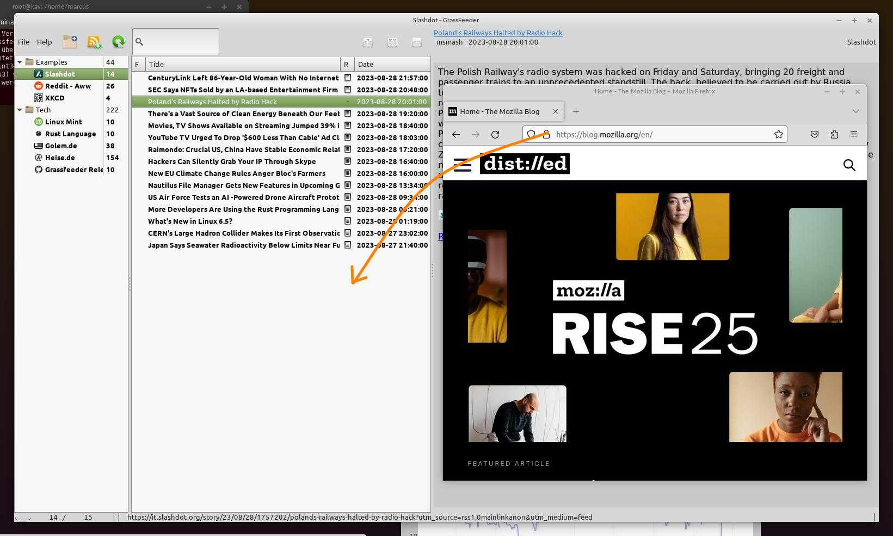
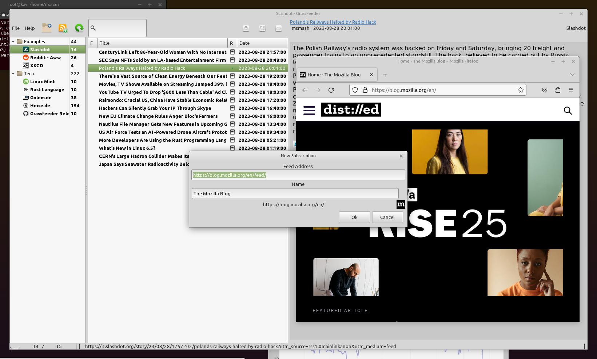
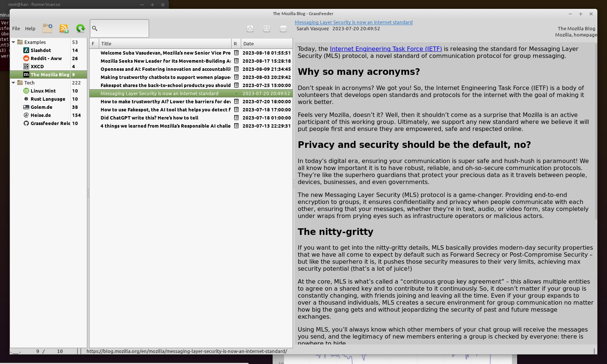

# GrassFeeder

RSS Feed Reader anno 2022

* This application polls Feeds (Streams of messages) regularly and presents them in a list of events.
* Browser Urls of blogs, news sites etc. can be dropped and create a new subscription
* It reads Atom and several RSS versions  
* Message texts are shown via the Gtk Webkit Engine.
* Licensed with LGPL-3, Available on Linux as Debian package or AppImage
* Translations: english, german.







## Installation
```
sudo add-apt-repository ppa:schleglermarcus/grassfeeder
sudo apt update
sudo apt-get install grassfeeder-gtk3
```


