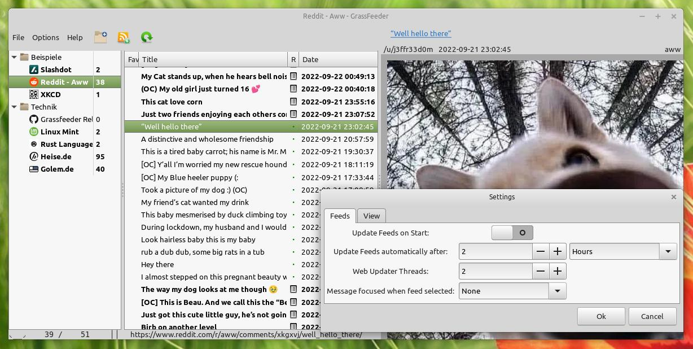
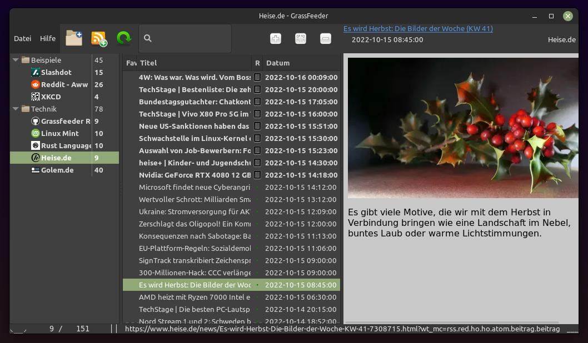

# GrassFeeder

RSS Feed Reader anno 2022

* This application polls Feeds (Streams of messages) regularly and presents them in a list of events.
* It reads Atom and several RSS versions  
* Message texts are shown via the Gtk Webkit Engine.
* Available on linux as debian package or AppImage
* Written in Rust (20k lines) with  LGPL-3.
* Translations: english, german.

