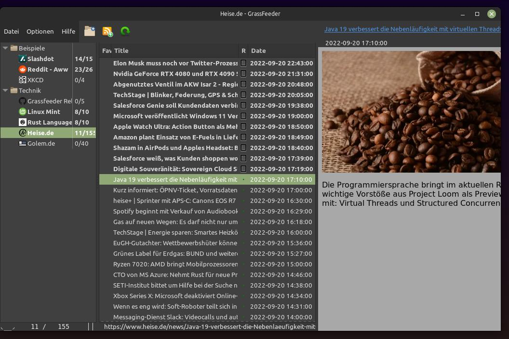

# GrassFeeder

RSS Feed Reader anno 2022

* This application polls Feeds (Streams of messages) regularly and presents them in a list of events.
* It reads Atom and several RSS versions and has a lower memory footprint. 
* It runs on linux, currently has only a debian package.   
* Message texts are shown via the Gtk Webkit Engine.
* Written in Rust (18k lines) with  LGPL-3.
* Translations: english, german.
* It is yet very fresh, not production ready

